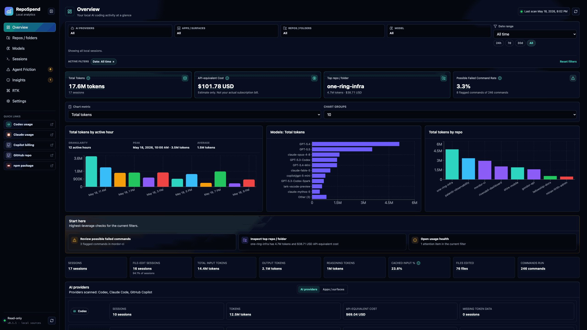
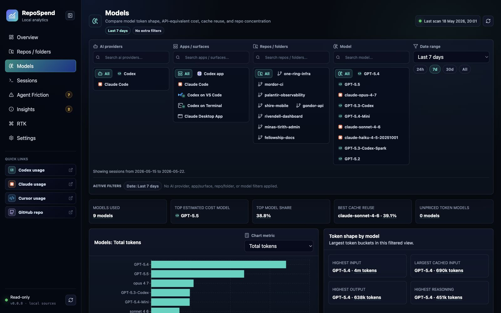

# RepoSpend

RepoSpend is a local-first dashboard for tracking AI coding token usage and API-equivalent spend by repository, session, model, and tool. It supports local Codex, Claude Code, and GitHub Copilot usage data, runs with `npx repospend`, and does not upload prompts, code, transcripts, or usage data.

[](https://www.npmjs.com/package/repospend)
[](https://www.npmjs.com/package/repospend)
[](./LICENSE)
[](https://www.npmjs.com/package/repospend)
[](https://github.com/mehmetdemircs/RepoSpend/actions/workflows/ci.yml)

RepoSpend turns local AI coding usage data into a repo-level cost dashboard, so
developers can see which projects, sessions, models, and tools are driving token
usage and estimated API-equivalent cost.

Project links:

- Website: [https://repospend.com](https://repospend.com)
- GitHub: [https://github.com/mehmetdemircs/RepoSpend](https://github.com/mehmetdemircs/RepoSpend)
- npm package: [`repospend`](https://www.npmjs.com/package/repospend)
- AI-readable summary: [docs/llms.txt](docs/llms.txt)

```bash
npx repospend
```

RepoSpend opens a local dashboard, usually at
[http://localhost:2005](http://localhost:2005).

Best for developers who want to:

- see which repositories are driving AI coding usage
- compare Codex, Claude Code, and GitHub Copilot usage locally
- inspect expensive sessions without uploading prompts or code
- understand token shape, cache reuse, model mix, and agent friction

## Preview



Preview media uses fictional Middle-earth demo data. The Lord of the Rings themed
repo names, sessions, prompts, token counts, models, and costs are intentional; no
private repository data is shown.

## What is RepoSpend?

RepoSpend is a local-first AI coding spend dashboard for developers and teams
who want to understand usage by repository instead of only by account, day, or
tool. It reads supported local files in read-only mode, normalizes them into
sessions, and groups them by Git repository.

Use it to inspect Codex token usage, Claude Code token usage by repo, GitHub
Copilot local usage data, model mix, cache reuse, and the sessions behind high
estimated API-equivalent spend.

## Why RepoSpend?

AI coding tools are powerful, but it is hard to see which repo, session, model,
or workflow is responsible for the usage.

RepoSpend helps answer practical questions:

- Which repo is using the most tokens?
- Which sessions were unusually expensive?
- Which model or tool generated the spend?
- What token shape drove the cost: input, cached input, output, or reasoning?
- Are cache reads reducing repeated input work?
- Is spend concentrated in one model, one repo, or one day?
- Where did the agent get stuck retrying commands?
- Which sessions should be exported or reviewed later?
- How much would this usage roughly cost at API-style rates?

Everything stays local.

## Quick Start

Run without installing globally:

```bash
npx repospend
```

Or install it once:

```bash
npm install -g repospend
repospend
```

RepoSpend starts a local dashboard, binds to localhost, opens your browser, and
prints the dashboard URL. By default it runs at
[http://localhost:2005](http://localhost:2005).

## Supported Tools

| Tool | Status | Notes |
|---|---|---|
| Codex | Most complete support | Tokens, models, sessions, repo grouping, command friction |
| Claude Code | Initial support | Sessions, projects, models, timestamps, tokens when available |
| GitHub Copilot | Initial support | Copilot CLI OTEL exports, Copilot CLI session state, and VS Code Copilot Chat transcripts; costs only when local data includes full token splits |
| Cursor | Experimental opt-in | Local JSONL and SQLite/vscdb discovery; tokens/cost only when local data includes them |
| RTK | Token reduction workflow | Not an AI model or coding assistant; shown by default as workflow context for reducing token waste |

RepoSpend started as a Codex-first release. Claude Code support is newer, and
GitHub Copilot support is newest. Cursor is off by default because accurate
Cursor token usage often requires account-backed usage data rather than local
files alone.

## Requirements

- Node.js `20` or newer
- macOS, Linux, or Windows
- Local Codex, Claude Code, or GitHub Copilot data for usage analytics
- Optional RTK data if you want token-reduction workflow context
- Cursor data only if you enable experimental Cursor import

RepoSpend uses `better-sqlite3`, so npm may install a native SQLite package for
your platform.

## What It Shows

RepoSpend helps you break down local AI coding usage by:

- repo, session, day, and hour
- model, source/tool, and app/surface where detectable
- input, cached input, output, and reasoning token shape
- estimated API-equivalent cost

Nested paths are grouped by Git root so usage rolls up to the repository. When no Git root is available, RepoSpend uses the outermost project marker below a safe shared-folder boundary, such as `package.json`, and keeps the grouping visibly unverified.

## Screenshots

### Repositories


Compare spend, tokens, sessions, cache hit rate, file edits, and token intensity.

### Repository Detail


Inspect cost concentration, warnings, token shape, sessions, and command signals.

### Models



Compare token shape, API-equivalent cost, cache reuse, and repo concentration.

### Sessions


Search and sort individual AI coding runs by repo, tool, model, cost, and tokens.

### Session Detail


Review one run's cost, tokens, model, file edits, commands, and issues.

### Agent Friction


Separate blocking command failures from harmless shell exits.

## Privacy

RepoSpend is local-first. Everything the dashboard shows comes from files already
on your machine.

- No login or account required.
- No telemetry.
- No prompt or transcript uploads.
- It does not modify Codex, Claude Code, GitHub Copilot, Cursor, or RTK files.
- It does not claim to match your subscription bill exactly.
- It does not read Codex Desktop server-side sessions that are not stored locally.

## Cost Estimates, Not Invoices

RepoSpend shows **API-equivalent cost**.

RepoSpend estimates cost from local token counts and local pricing assumptions.
It is useful for comparing repos and sessions, but it is not an invoice. Actual
cost can differ because of subscriptions, credits, included usage, account terms,
provider changes, or missing local token data.

For pricing details, see [docs/pricing.md](docs/pricing.md).

### Token Accounting

RepoSpend uses normalized model-work totals:

```text
totalTokens = inputTokens + outputTokens + reasoningTokens
```

Cache reads and cache writes are kept as input sub-buckets and priced once. For
Claude, RepoSpend also uses the 5-minute vs 1-hour cache-write split recorded in
local transcripts when available. This means RepoSpend token totals may look
lower than tools that display cache reads/writes as separate addable token
columns, and Claude API-equivalent cost may differ from tools that collapse all
cache writes into one rate.

For the detailed accounting model and comparison with `ccusage` and Tokscale,
see [docs/token-accounting.md](docs/token-accounting.md).

## Data Sources

RepoSpend only reads local files. It does not edit Codex, Claude Code, GitHub
Copilot, Cursor, or RTK data.

| Source | What RepoSpend reads | Notes |
|---|---|---|
| Codex | Local CLI state and session files | Most complete token, model, repo, session, and command-friction support |
| Claude Code | Local project and session JSONL files | Tokens and models are shown when present in local transcripts |
| GitHub Copilot | Local OTEL exports, session-state, and VS Code Copilot Chat files | Full cost requires local input/cache/output token splits |
| Cursor | Experimental local transcript/database discovery | Off by default; local files vary and often omit exact token/cost data |
| RTK | Local workflow context | Not an AI token source; helps explain token-reduction practices |

Detailed paths, source-specific behavior, and Cursor troubleshooting live in
[docs/data-sources.md](docs/data-sources.md).

RepoSpend-owned settings live under `~/.repospend/`, including pricing overrides,
local app settings, and the parse cache.

## FAQ

### What is RepoSpend?

RepoSpend is a local-first dashboard for tracking AI coding token usage and
API-equivalent spend by repository, session, model, and tool.

### Does RepoSpend upload prompts or code?

No. RepoSpend runs locally, reads supported client files in read-only mode, and
does not upload prompts, code, transcripts, or usage data.

### Which tools does RepoSpend support?

RepoSpend tracks local usage from Codex, Claude Code, and GitHub Copilot. Cursor
import is experimental and opt-in. RTK can appear as workflow context for
token-reduction signals, but it is not an AI model or coding assistant. Support
depth depends on what each tool stores locally; Codex is currently the most
complete path.

### How do I run RepoSpend?

Run it with:

```bash
npx repospend
```

RepoSpend starts a localhost dashboard, usually at
[http://localhost:2005](http://localhost:2005).

### How is RepoSpend different from ccusage?

`ccusage` is excellent for Claude Code usage totals and terminal reporting.
RepoSpend is a visual, repo-first dashboard across multiple AI coding tools. It
focuses on repository grouping, session inspection, model mix, token shape,
cache reuse, exports, and command/agent friction signals.

### Is RepoSpend open source?

Yes. RepoSpend is open source under the Apache-2.0 license. The GitHub repository
is [mehmetdemircs/RepoSpend](https://github.com/mehmetdemircs/RepoSpend).

## Compared With Other Usage Tools

RepoSpend is complementary to command-line usage tools such as `ccusage` and
generic Claude Code usage monitors.

Use `ccusage` when you want fast Claude Code totals, daily breakdowns, or a CLI
view that is close to Claude Code's local usage files. Use RepoSpend when you
want a local dashboard that compares AI coding usage across repos, sessions,
models, and tools.

When comparing totals, expect some intentional differences:

- RepoSpend includes Claude Desktop/local-agent session files when they exist;
  many terminal-first tools count only `~/.claude/projects`.
- RepoSpend keeps cached input and cache writes as input sub-buckets rather than
  adding them again to headline token totals.
- RepoSpend prices Claude cache writes by the recorded 5-minute vs 1-hour TTL
  split when local transcripts expose it.
- RepoSpend separates Codex visible output from reasoning output so reasoning is
  priced once.

Generic Claude Code monitors usually focus on one source. RepoSpend is designed
as a repo-level AI coding cost tracker: it brings together local Codex, Claude
Code, and GitHub Copilot data, includes experimental Cursor imports when enabled,
and can show optional RTK workflow context for token-reduction signals. The
dashboard then explains the token shape and sessions behind the estimated
API-equivalent spend.

## Commands

Most users only need:

```bash
repospend
```

There are also a few terminal-friendly commands:

```bash
repospend scan
repospend doctor
repospend by-repo
repospend by-day
repospend by-hour
repospend by-model
repospend by-app
repospend export --format json
repospend export --format csv
```

Most commands also accept dashboard-style filters:

```bash
repospend by-repo --source codex   # codex, claude, copilot, cursor, all
repospend export --format csv --repo my-app --from 2026-05-01 --to 2026-05-29
repospend doctor --model gpt-5-codex --sourceApp "VS Code"
```

Use `REPOSPEND_NO_OPEN=1 repospend` if you want the URL printed without opening a
browser.

## Current Limits

- Codex support is still the most complete path for token and command-friction
  analysis.
- Claude Code support is initial: sessions, projects, timestamps, models, and
  token usage are shown when present in local JSONL files.
- Claude Code sessions without local token details are shown with unknown
  tokens/cost.
- Cursor support is experimental and off by default: local transcript/session
  discovery is best-effort, and Cursor may omit token/cost details or change
  local schemas.
- Cost estimates do not represent subscription billing, credits, regional
  pricing, or account-specific terms.
- Some older sessions may not include full token, command, or prompt details.
- RTK is workflow context, not an AI token source; it helps explain token-reduction
  practices alongside AI usage.
- On Windows, RepoSpend captures Codex **CLI** usage from `~/.codex/`. The Codex
  **Desktop app** does not persist session transcripts or per-turn token usage to
  disk; real session data lives server-side.

## Develop

From source:

```bash
pnpm install
pnpm dev
```

Useful checks before publishing:

```bash
pnpm lint
pnpm typecheck
pnpm test
pnpm build
```

`pnpm dev` starts the API on
[http://127.0.0.1:4318](http://127.0.0.1:4318) and the dashboard on
[http://127.0.0.1:2005](http://127.0.0.1:2005), with `/api` proxied locally.

## Maintainers

Publishing notes are in [docs/PUBLISHING.md](docs/PUBLISHING.md).

## Security

Please see [SECURITY.md](SECURITY.md) for reporting security issues.

## Changelog

Please see [CHANGELOG.md](CHANGELOG.md) for release notes.

## License

[Apache-2.0](https://www.apache.org/licenses/LICENSE-2.0)
