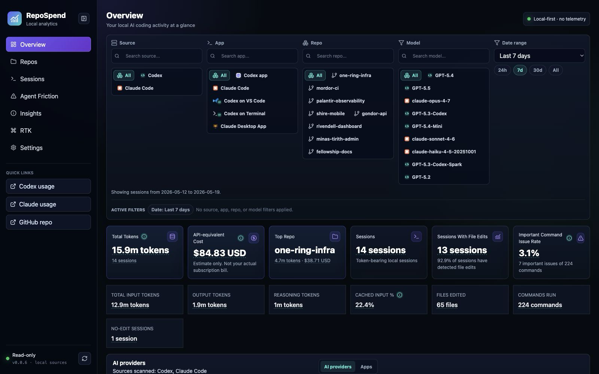
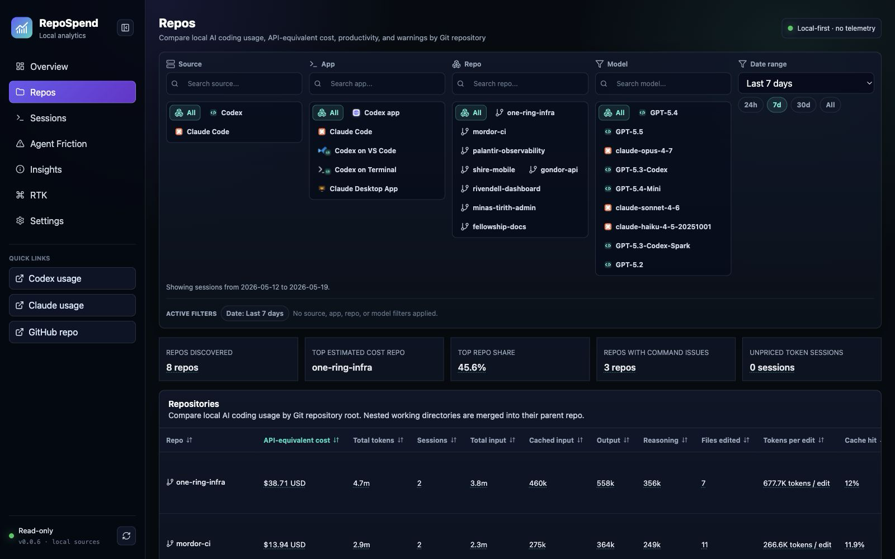
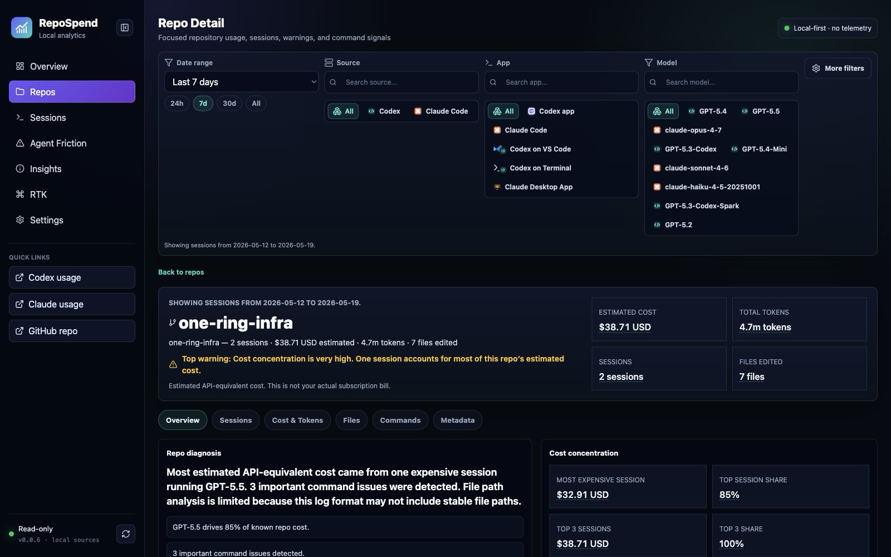
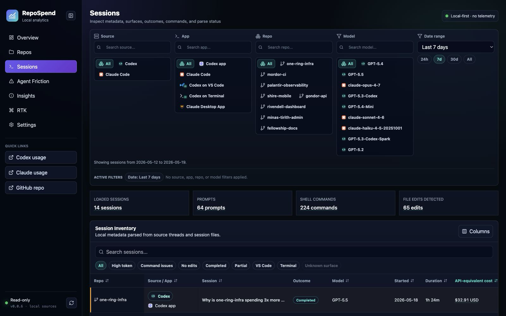
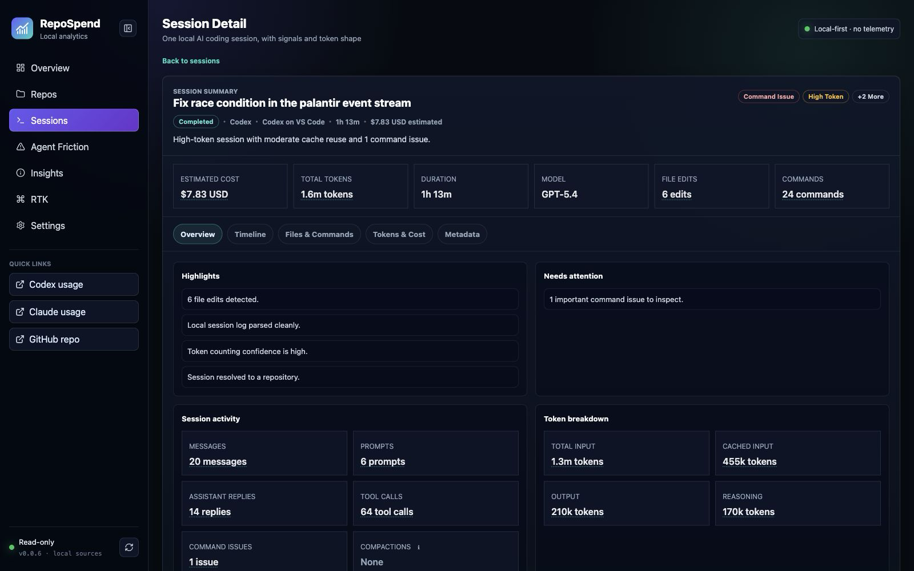
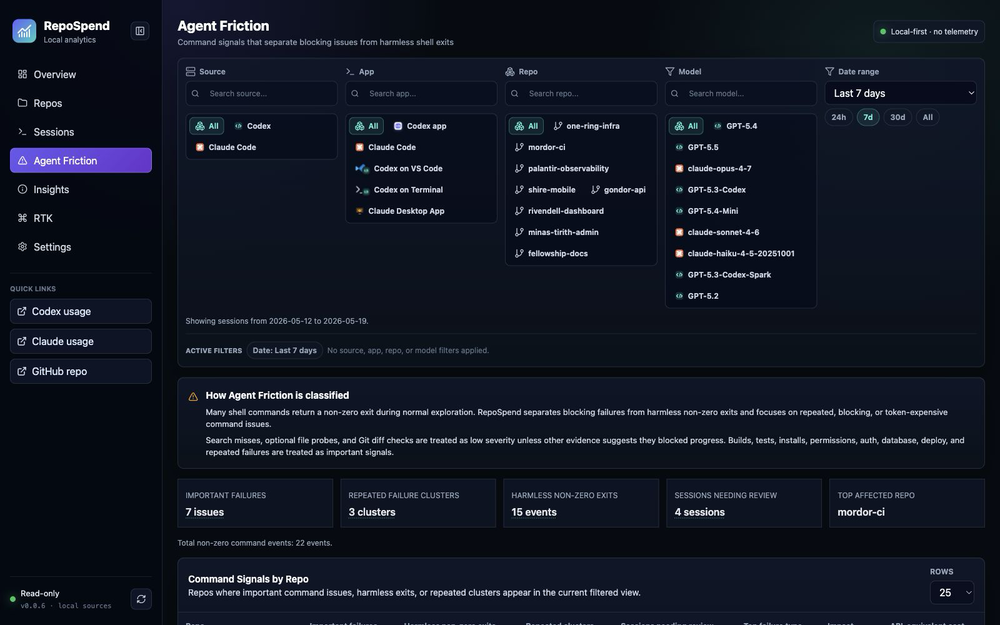

# RepoSpend

[](https://www.npmjs.com/package/repospend)
[](https://www.npmjs.com/package/repospend)
[](./LICENSE)
[](https://www.npmjs.com/package/repospend)
[](https://github.com/mehmetdemircs/RepoSpend/actions/workflows/ci.yml)

RepoSpend is a local-first dashboard for seeing which repositories are using the
most AI coding tokens.

It reads supported local Codex and Claude Code files in read-only mode, groups
sessions by Git repo, and shows token usage, cost estimates, models, sessions,
and agent friction.

No login. No telemetry. No prompt uploads.

## Quick Start

You can run RepoSpend without installing it globally:

```bash
npx repospend
```

Then open the local dashboard URL printed in your terminal.

Or install it once:

```bash
npm install -g repospend
repospend
```

RepoSpend starts a local dashboard, binds to localhost, opens your browser, and
prints the dashboard URL. By default it runs at
[http://localhost:2005](http://localhost:2005).

RepoSpend requires Node.js `20` or newer. It uses `better-sqlite3`, so npm may
install a native SQLite package for your platform.

## Good For

- finding which repo is burning the most AI coding tokens
- reviewing expensive or unusual coding-agent sessions
- comparing Codex and Claude Code usage locally
- spotting repeated command failures and agent friction
- exporting usage data for your own analysis

## Screenshots

Screenshots use fictional Middle-earth demo data. The Lord of the Rings themed
repo names, sessions, prompts, token counts, and costs are intentional; no private
repository data is shown.

### Overview



The main dashboard summarizes AI coding tokens, API-equivalent cost, top repos,
cache reuse, file edits, and command issue rate.

### Repositories



The repos view compares spend, tokens, sessions, cache hit rate, file edits, and
token intensity across projects.

### Repository Detail



Repo detail explains why a project stands out, including cost concentration,
warnings, token shape, sessions, and command signals.

### Sessions



The sessions view makes individual AI coding runs searchable and sortable by
repo, tool, model, outcome, cost, tokens, and activity.

### Session Detail



Session detail shows the shape of one run: cost, tokens, model, file edits,
commands, highlights, and issues to inspect.

### Agent Friction



Agent Friction separates blocking command failures from harmless shell exits so
high-token troubleshooting is easier to review.

## What It Shows

RepoSpend helps you break down local AI coding usage by:

- repo
- session
- day and hour
- model
- source/tool and app/surface, where detectable
- token type
- estimated API-equivalent cost

If Codex records work from both of these paths:

```text
/Users/elrond/dev/RivendellRecords
/Users/elrond/dev/RivendellRecords/apps/web
```

RepoSpend walks up to the Git root and shows them together as one
`RivendellRecords` project.

## Supported Tools

| Tool | Status | Notes |
|---|---|---|
| Codex | Most complete support | Tokens, models, sessions, repo grouping, command friction |
| Claude Code | Initial support | Sessions, projects, models, timestamps, tokens when available |
| RTK | Optional/local | Shown only when local RTK data exists |

RepoSpend started as a Codex-first release. Claude Code support is newer and
depends on what your local Claude Code files include.

## Privacy

RepoSpend is local-first:

- no login
- no telemetry
- no prompt uploads
- no changes to Codex or Claude Code files

Everything the dashboard shows comes from files already on your machine.

## Cost Estimates, Not Invoices

RepoSpend shows **API-equivalent cost**.

That means it estimates cost from local token counts and the pricing assumptions
stored in RepoSpend. It is useful for comparing repos and sessions, but it is not
an invoice.

Your actual cost may be different because of subscriptions, credits, included
usage, account-level terms, provider changes, or other billing details. If you use
Codex or Claude Code through a subscription, read the number as "what this token
usage would roughly cost at API-style rates."

Claude Code cost may show as unknown when local files do not include token counts
or a model name. RepoSpend shows those sessions with unknown tokens/cost rather
than guessing.

### Why RepoSpend's token totals can look lower than `ccusage`

If you compare RepoSpend to `ccusage` you may see matching costs but different
"total tokens", especially for Codex where cache reads dominate. This is
expected.

RepoSpend treats `cached_input_tokens` as a **subset of** `input_tokens`, which
is how the OpenAI and Anthropic APIs document the field. The "total tokens"
number reflects the tokens the model actually processed. `ccusage` adds cached
tokens as a separate line item in its "Total Tokens" column, which inflates the
total but does not change billing.

The dollar cost is the source of truth and should agree between the two tools
within rounding. If costs diverge, that is a real discrepancy worth
investigating; token-count divergence on its own usually is not.

### Codex Desktop on Windows

RepoSpend captures Codex **CLI** usage on Windows from `~/.codex/`. The Codex
**Desktop app** (installed as the MSIX package
`OpenAI.Codex_<id>` under `%LOCALAPPDATA%\Packages\`) does not persist session
transcripts or per-turn token usage to disk. Only Electron caches and debug
logs are stored locally. Real session data lives server-side. Neither RepoSpend
nor `ccusage` can report on Codex Desktop usage from local files alone.

## What It Reads

RepoSpend only reads local files. It does not edit Codex, Claude Code, or RTK
data.

Codex data:

```text
~/.codex/state_5.sqlite
~/.codex/sessions
```

Claude Code data:

```text
~/.claude/projects
~/.config/claude/projects
~/Library/Application Support/Claude/local-agent-mode-sessions
~/.config/Claude/local-agent-mode-sessions
```

RepoSpend also checks `~/.claude/history.jsonl` for source status, but does not
import history-only entries into usage analytics because they do not contain
reliable token/model data.

Claude Code transcript files can contain prompt text, tool output, and file
contents. RepoSpend keeps all scanning local.

RepoSpend-owned settings:

```text
~/.repospend/pricing.json
~/.repospend/config.json
```

The Settings page includes a reset action for RepoSpend-owned files under
`~/.repospend/`. It does not delete or edit anything under `~/.codex` or
`~/.claude`.

## Commands

Most users only need:

```bash
repospend
```

There are also a few terminal-friendly commands:

```bash
repospend scan
repospend by-repo
repospend by-day
repospend by-hour
repospend by-model
repospend by-app
repospend export --format json
repospend export --format csv
```

Most commands also accept a simple source filter:

```bash
repospend by-repo --source codex
repospend by-repo --source claude
repospend by-repo --source all
```

Use `REPOSPEND_NO_OPEN=1 repospend` if you want the URL printed without opening a
browser.

## Current Limits

- Codex support is still the most complete path for token and command-friction
  analysis.
- Claude Code support is initial: sessions, projects, timestamps, models, and
  token usage are shown when present in local JSONL files.
- Claude Code sessions without local token details are shown with unknown
  tokens/cost.
- Cost estimates do not represent subscription billing, credits, regional
  pricing, or account-specific terms.
- Budget alerts are not active yet.
- Some older sessions may not include full token, command, or prompt details.
- RTK analytics appear only when local `rtk` data is available.

## Develop

From source:

```bash
pnpm install
pnpm dev
```

Useful checks before publishing:

```bash
pnpm lint
pnpm typecheck
pnpm test
pnpm build
```

`pnpm dev` starts the API on
[http://127.0.0.1:4318](http://127.0.0.1:4318) and the dashboard on
[http://127.0.0.1:2005](http://127.0.0.1:2005), with `/api` proxied locally.

## Maintainers

Publishing notes are in [docs/PUBLISHING.md](docs/PUBLISHING.md).

## Security

Please see [SECURITY.md](SECURITY.md) for reporting security issues.

## Changelog

Please see [CHANGELOG.md](CHANGELOG.md) for release notes.

## License

[Apache-2.0](https://www.apache.org/licenses/LICENSE-2.0)
